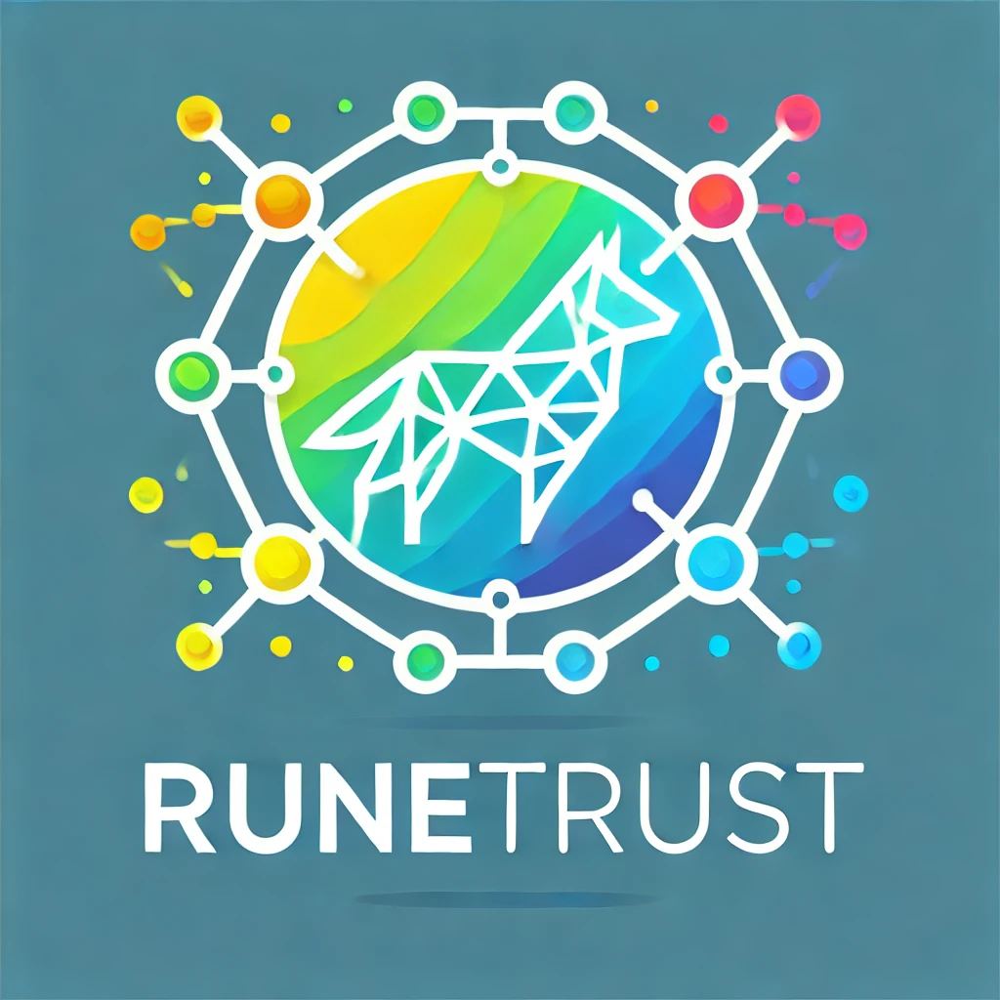

# RuneTrust: Confidential Trust Score Aggregator

### New Gen Era: From Traditional Credit Scores to Holistic Trust Scores

## TL;DR:
**RuneTrust** is a decentralized trust score aggregator built on the **Fhenix** and **Rootstock** blockchains. It is designed to provide privacy-preserving trust score computations, leveraging **Fully Homomorphic Encryption (FHE)** and **Ordinals/Runes** to ensure secure computation of trust scores while safeguarding user data confidentiality.

This platform is ideal for decentralized lending, reputation systems, and financial services, offering verifiable yet private trust metrics to ensure users' privacy and trustworthiness.

---

## How It’s Made:

RuneTrust is composed of three key components that integrate **Fhenix** contracts:

### 1. LendingContract
- **Purpose**: Facilitates decentralized lending based on encrypted trust scores.
- **Details**: Borrowers submit loan requests using encrypted trust scores and specify loan terms such as interest rates and durations. Lenders can approve loans after verifying the borrower’s trust score through the **TrustScoreAggregator**. The contract manages loan approval, repayment, and tracks borrower loan histories. Loans are only approved if the borrower’s trust score exceeds a specified threshold.

### 2. TrustScoreAggregator
- **Purpose**: Aggregates, manages, and updates encrypted trust scores using **Fhenix** contracts.
- **Details**: Trust scores are stored in encrypted form and can only be accessed by authorized parties with the appropriate permissions using **Fhenix's Permissioned** access control. The contract also enables increasing or decreasing trust scores based on user activity (e.g., social or financial actions), using **FHERC20** for trust score token management.

### 3. TrustScoreRelayer
- **Purpose**: Relays trust scores across multiple blockchains, ensuring privacy is maintained.
- **Details**: The **TrustScoreRelayer** facilitates the secure transfer of trust scores between different blockchains, such as **Fhenix** and **Rootstock**, while maintaining privacy. Using **Fhenix** for encrypted computation and **Rootstock** for verifiable on-chain records, the **TrustScoreRelayer** ensures that trust scores remain confidential while being shared and verified across different blockchain ecosystems.

---

## Solution:
**RuneTrust** offers a robust solution for decentralized platforms needing verifiable yet private trust metrics. This solution is particularly advantageous for decentralized lending platforms and reputation-based services, where trust is critical for managing risk, and privacy is essential for user adoption.

---

- **TrustScoreAggregator Integration**: Integrated with **FHERC20**, allowing encrypted trust scores to be increased or decreased through the issuance or burning of tokens.
- **Permission System**: Permissions for viewing or updating trust scores are managed via the **Permissioned** contract, with EIP-712 signature-based verification.
- **TrustScore Relayer**: The **TrustScoreRelayer** allows trust scores to be securely relayed across blockchains, such as from **Fhenix** to **Rootstock**, while preserving privacy through encrypted computations.
- **Encrypted Trust Scores**: All trust scores are stored and managed in encrypted form using **Fhenix.js**, ensuring privacy while enabling secure computation of trust metrics.

---

## Technologies Used:

1. **Fhenix**:
   - **Fully Homomorphic Encryption (FHE)**-powered computations for encrypted trust scores.
   - Aggregates encrypted data from multiple trusted sources (e.g., financial behavior, reputation metrics).
   - **Fhenix.js** is used for encryption, decryption, and computation, ensuring data privacy.

2. **Rootstock (Ordinals/Runes)**:
   - Smart contracts on Rootstock create verifiable on-chain records of trust-based actions.
   - Each trust-based action is represented as a **Rune**, a non-fungible digital asset that verifies user reputation and trustworthiness. These runes can be used by external services or platforms to verify user activity without compromising data confidentiality.

3. **TrustScore Relayer**:
   - Relays encrypted trust scores across blockchains while preserving privacy.
   - The relayer ensures that encrypted trust scores from **Fhenix** can be verified and relayed to **Rootstock**, providing a seamless connection between blockchains without exposing sensitive data.

---

## Deployed Contracts:

- **Fhenix Testnet**:
  - **Trust Score Aggregator**: Manages FHE-powered computations for secure trust score management.
  - **FHERC20**: Used for encrypted token-based management of trust scores.

- **Rootstock**:
  - **LendingContract**: Manages decentralized loan requests and approvals based on the borrower’s encrypted trust score from the **TrustScoreAggregator**.
  - **TrustScoreRelayer**: Relays trust scores between blockchains, ensuring that private data computed on **Fhenix** can be securely verified on **Rootstock**.

---

## Vision:
**RuneTrust** seeks to become the decentralized standard for trust metrics, enabling privacy-preserving yet verifiable trust scores across multiple blockchain ecosystems. By integrating **Fhenix** and **Rootstock**, **RuneTrust** provides a critical tool for decentralized finance (DeFi), reputation systems, and privacy-focused financial services.

---